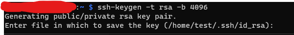
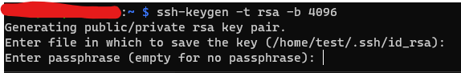

# Repositorio para instalar Plex, Samba y rTorrent en Docker containers en Raspberry PI
 Repository to run Plex, rTorrent and samba on containers on a Raspberry pi
---
Con este repositorio puedes correr un servidor Plex en un contenedor de Docker en una Raspberry PI usando un docker compose y su respectivo YAML file
## Requisitos iniciales
---
**Creacion de usuario con sudo para conectarse al server**

*Todos estos comandos se deben correr desde root*

Agregar tu usuario (cambiar `plexuser` con tu nombre de usuario)
~~~
useradd -md /home/plexuser plexuser -G sudo
~~~
Corre este comando para crear el archivo `/etc/sudoers.d/user-plex` con este texto:
~~~
echo "plexuser   ALL=(ALL:ALL) NOPASSWD:ALL" > /etc/sudoers.d/user-plex 
~~~
Corre el siguiente comand para cambiarle los permisos:
~~~
chmod 600 /etc/sudoers.d/user-plex
~~~
Ejecute el siguiente comando para crear el directorio .ssh y el archivo authorized_keys
~~~
mkdir /home/plexuser/.ssh && touch /home/plexuser/.ssh/authorized_keys && chown -R plexuser /home/plexuser/.ssh && chmod 700 /home/plexuser/.ssh && chmod 600 /home/plexuser/.ssh/authorized_keys
~~~
Corre este comando para configurar el ssh login con ssh
~~~
echo "AllowUsers plexuser dockeruser
Match User plexuser,dockeruser
        PubkeyAuthentication yes
        PasswordAuthentication no
        AllowTcpForwarding yes
        PermitTunnel yes
        X11Forwarding yes"  | sudo tee -a /etc/ssh/sshd_config
sudo systemctl enable ssh && sudo systemctl start ssh
~~~
Ahora en la maquina que usarás para conectarte por ssh, corre el siguiente comando para crear tus llaves ssh
~~~
ssh-keygen -t rsa -b 4096
~~~
Da un enter para dejar por default el path y nombre del archivo

**NOTA:** Deberás ingresar una contraseña para la llave ssh y confirmar la passphrase

**Crear usuario para docker**

*Estos comandos se deben correr desde root*

gregar tu usuario (cambiar `dockeruser` con tu nombre de usuario)
~~~
groupadd docker && useradd -md /home/dockeruser dockeruser -g docker
~~~

**Instalación de paquetes básicos**

Corre este comando
~~~
sudo apt-get update && sudo apt-get install -y \
     apt-transport-https \
     ca-certificates \
     curl \
     gnupg2 \
     software-properties-common \
     vim \
     fail2ban \
     ntfs-3g
~~~
Instalar Docker
~~~
curl -fsSL https://download.docker.com/linux/debian/gpg | sudo apt-key add -
sudo apt-key fingerprint 0EBFCD88
echo "deb [arch=armhf] https://download.docker.com/linux/debian \
     $(lsb_release -cs) stable" | \
    sudo tee /etc/apt/sources.list.d/docker.list
sudo apt-get update && sudo apt-get install -y --no-install-recommends docker-ce docker-compose
~~~
Modifica tu docker config para que guarde los temps en el disco:
~~~
sudo vim /etc/default/docker
# Agregar esta linea al final con la ruta de tu disco externo montado
export DOCKER_TMPDIR="/mnt/storage/docker-tmp"
~~~

## (Opcional) Montar HDD en la Raspbery PI
Montar el disco (es necesario ntfs-3g si es que tenes tu disco en NTFS) NOTA: en este [link](https://youtu.be/OYAnrmbpHeQ?t=5543) pueden ver la explicación en vivo
~~~
# usamos la terminal como root porque vamos a ejecutar algunos comandos que necesitan ese modo de ejecución
sudo su
# buscamos el disco que querramos montar (por ejemplo la partición sdb1 del disco sdb)
fdisk -l
# pueden usar el siguiente comando para obtener el UUID
ls -l /dev/disk/by-uuid/
# y simplemente montamos el disco en el archivo /etc/fstab (pueden hacerlo por el editor que les guste o por consola)
echo UUID="{nombre del disco o UUID que es único por cada disco}" {directorio donde queremos montarlo} (por ejemplo /mnt/storage) ntfs-3g defaults,auto 0 0 | \
     sudo tee -a /etc/fstab
# Por ejemplo: 
# UUID=FE8A94918A94557D3 /mnt/storage ntfs-3g defaults,auto 0 0
# por último para que lea el archivo fstab
mount -a (o reiniciar)
~~~

## Correr los containers de Plex, Samba y rTorrent

Descarga el archivo docker-compose.yaml y corre el comando desde dockeruser
~~~
docker-compose -f ./docker-compose.yaml up -d
~~~

## (Optional) Crear cronjob para reiniciar el container de rTorrent
El container de rTorrent tienen un problema que hace que se quede colgado, a pesar de que que no es la mejor solución, en lo personal encontré una solución por medio de crear un cronjob para que reinicie el container

Corre este comando para crear el archivo de logs de este cronjob
~~~
touch ~/reporte_restart-rtorrent.txt
~~~

Ahora, corre este comando para abrir el crontab
~~~
crontab -e
~~~
Ahora que tienes abierto el archivo de Crontab, agrega la siguiente linea al final del archivo. Cambia el **DOCKER_ID** por el ID de tu container
~~~
0 7,13.20 * * * (docker restart DOCKER_ID && date >> ~/reporte_restart-rtorrent.txt)
~~~

>Significa que se ejecuta diario a las 7:00, 13:00 y 20:00, reiniciar el ID del container que se indique y guarda la fecha del reinicio en el archivo *~/reporte_restart-rtorrent.txt*, puedes agregar los horarios que consideres necesarios para el correcto funcionamiento

Guarda los cambios, corriendo:
~~~
ESC : wq ENTER
~~~